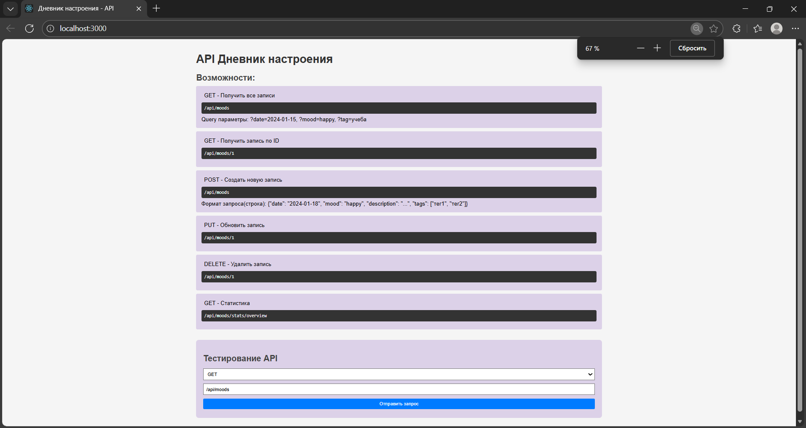
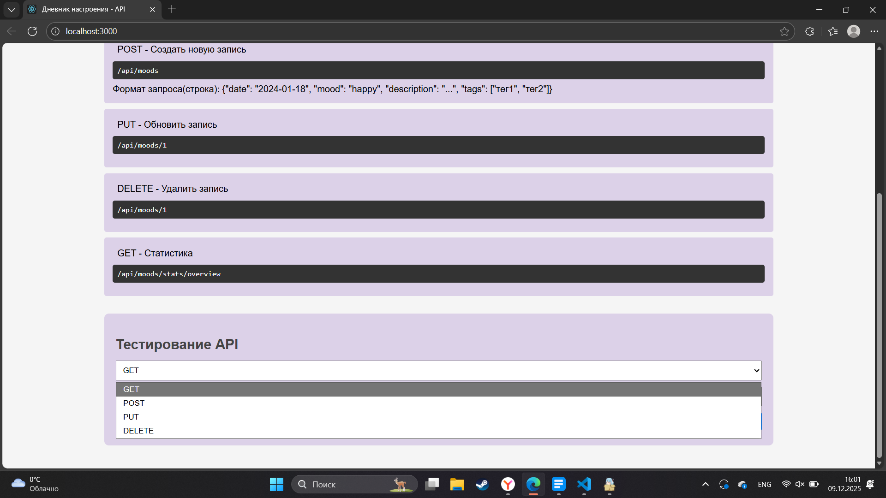
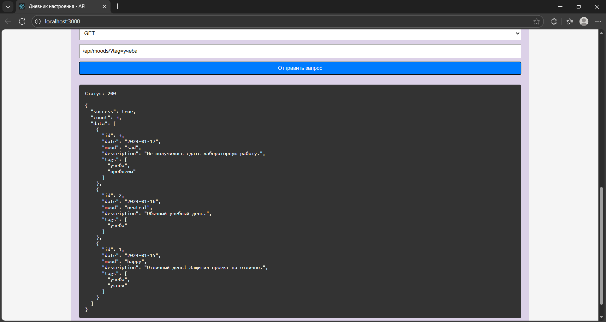
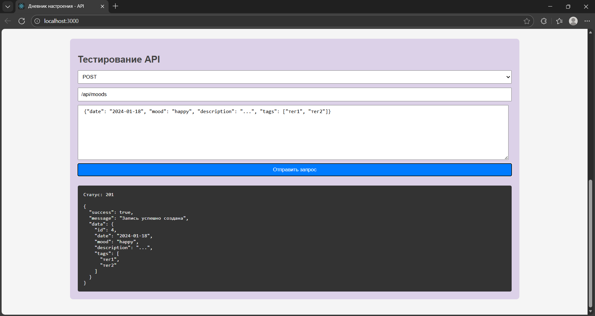
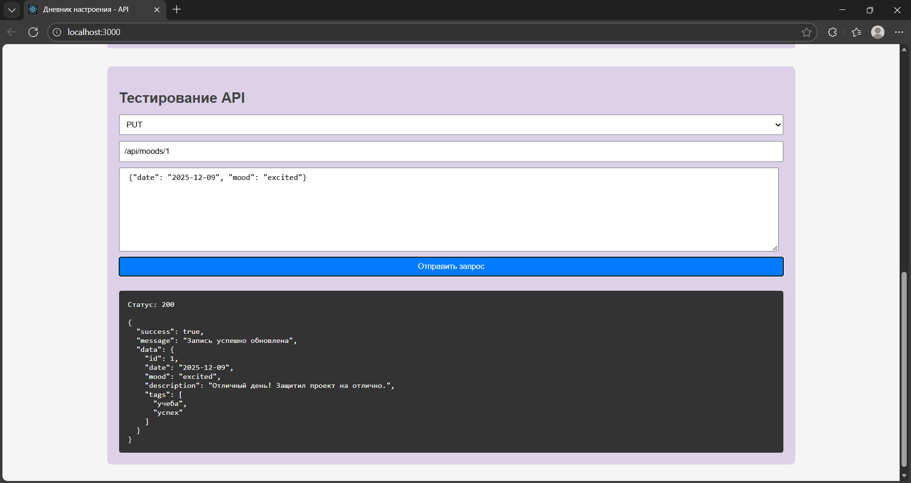
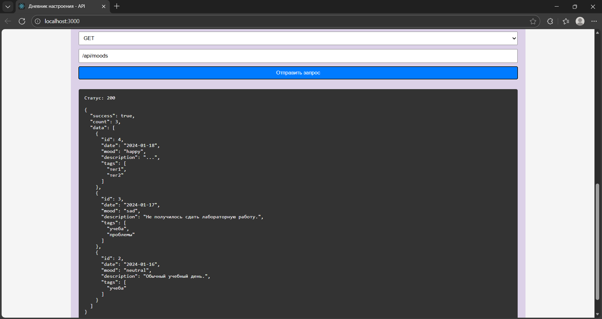

### Контрольная №5
# Функционал программы:
Главный экран:

Выбор метода:

При нажатии на кнопку:

Есть сортировка по данным:

При смене на POST добавляется возможность введения json:

Можно обновить данные по id:

Можно удалять данный по id:

В итоге программы:
